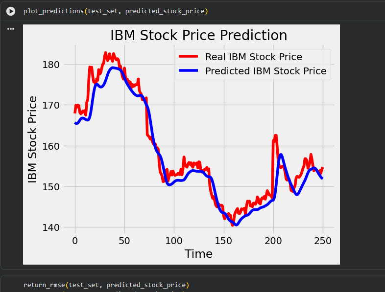
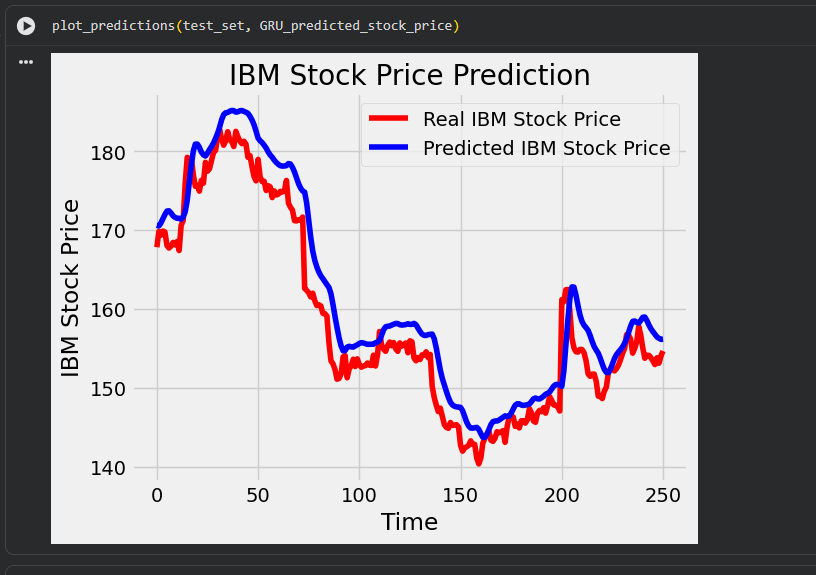
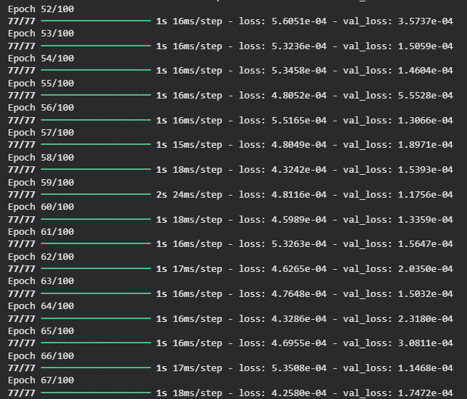
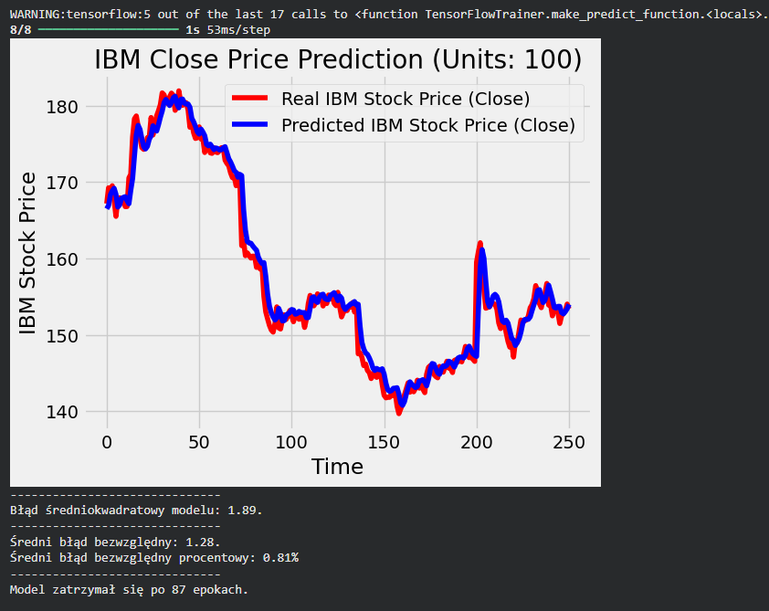

# Raport z Laboratorium 5: Rekurencyjne Sieci Neuronowe (LSTM i GRU)

**Cel zadania:** Przewidywanie cen akcji firmy IBM z wykorzystaniem modeli uczenia głębokiego oraz analiza wpływu różnych hiperparametrów na jakość predykcji.

---

## 1. Porównanie modeli bazowych: LSTM vs GRU

W pierwszej fazie przetestowano standardowe architektury oparte na komórkach LSTM oraz GRU dla atrybutu "High" z 50 jednostkami w warstwach ukrytych.

**Obserwacje z wykresów:**
Zarówno model LSTM, jak i GRU poprawnie zidentyfikowały ogólny trend spadkowy i wzrostowy cen akcji IBM. Widać jednak, że przy nagłych krachach lub skokach cen (ok. 150-160 kroku czasowego) predykcja jest wygładzona i reaguje z lekkim opóźnieniem. Wyniki wizualne obydwu architektur są do siebie bardzo zbliżone, co potwierdza, że prostsza budowa komórki GRU jest w stanie dorównać skutecznością LSTM.

**Wykres predykcji - Bazowy LSTM:**

**Wykres predykcji - Bazowy GRU:**

---

## 2. Eksperymenty z hiperparametrami i optymalizacja

Aby zredukować błąd i poprawić parametry sieci, przeprowadzono serię eksperymentów:

* **Ilość jednostek (A) & Atrybut predykcji (D):** Zwiększono liczbę jednostek z 50 do 100, aby sieć mogła zapamiętać więcej zależności, oraz zmieniono przewidywany atrybut z "High" na ostateczną cenę zamknięcia "Close".
* **Optymalizatory i Funkcje straty (B, C):** Zamiast podstawowego rozwiązania użyto optymalizatora `Adam` oraz funkcji straty `Huber`, która jest mniej wrażliwa na gwałtowne "peaki" cenowe (tzw. wartości odstające) na giełdzie niż klasyczne MSE.
* **Early Stopping z walidacją (E):** Zgodnie z dobrymi praktykami, do mechanizmu wczesnego zatrzymywania dodano monitorowanie na zbiorze walidacyjnym (`val_loss`). 

Poniższy zrzut logów uczenia potwierdza działanie walidacji – czas jednej epoki oscylował w granicach ~16-24 ms/step, a funkcja straty stabilnie malała:

---

## 3. Ostateczna konfiguracja i podsumowanie (RMSE < 2.0)

Wprowadzone modyfikacje przyniosły zamierzony skutek. Model w ostatecznej konfiguracji osiągnął bardzo dobry wynik błędu średniokwadratowego **RMSE = 1.89**, spełniając wymóg zejścia poniżej wartości 2.0.

### Wybrana najlepsza konfiguracja:
* **Model:** LSTM
* **Ilość jednostek:** 100
* **Atrybut:** Close
* **Optymalizator:** Adam
* **Funkcja straty:** Huber
* **Ochrona przed przeuczeniem:** Early Stopping monitorujący `val_loss` z marginesem cierpliwości ustawionym na 10.

**Uzasadnienie:**
Połączenie 100 jednostek LSTM z optymalizatorem Adam pozwoliło na skuteczniejsze wyłapywanie długoterminowych zależności w cenach zamknięcia ("Close"). Kluczowe okazało się zastosowanie mechanizmu Early Stopping opartego o `val_loss`. Zapobiegło to przeuczeniu (overfittingowi) na danych treningowych. Zamiast zaplanowanych 100 epok, **trening został automatycznie przerwany po 87 epoce**, a wagi cofnięte do najlepszego momentu, co zagwarantowało dobrą generalizację na zbiorze testowym.

**Ostateczne wyniki (Wykres + Metryki):**
